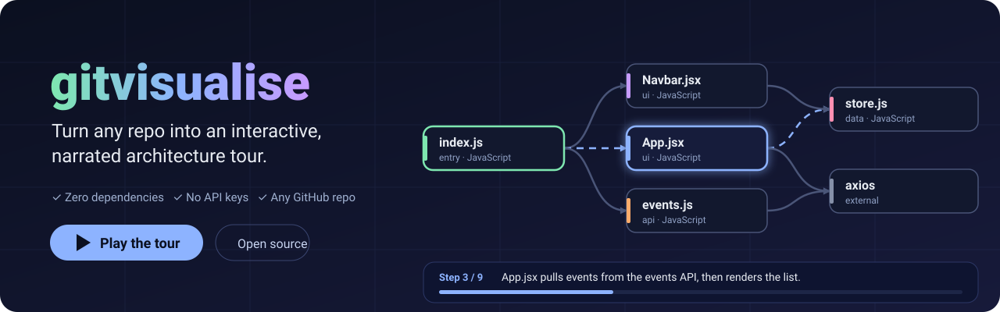
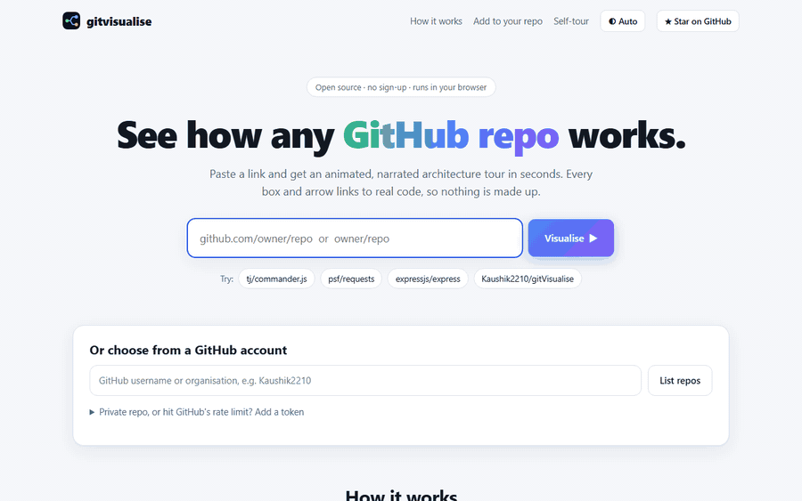
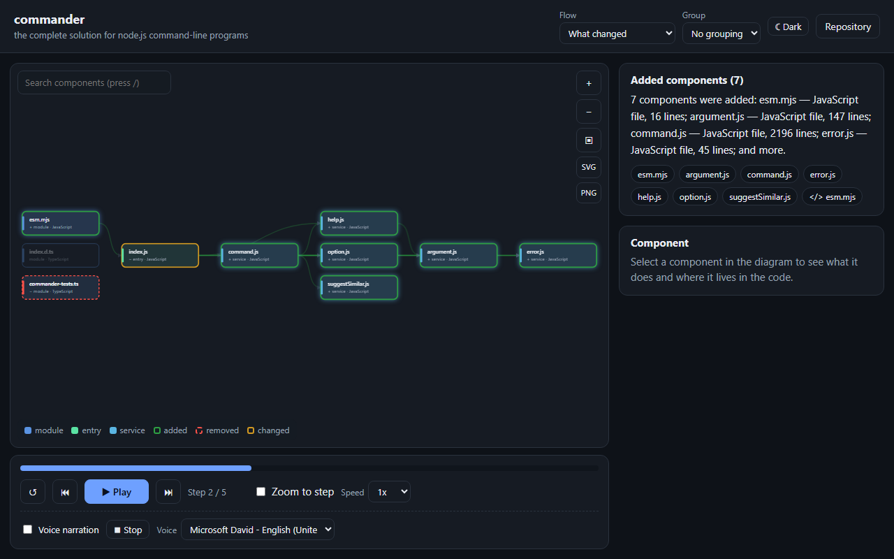
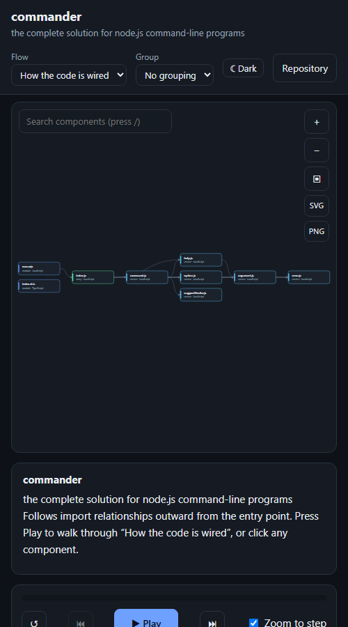
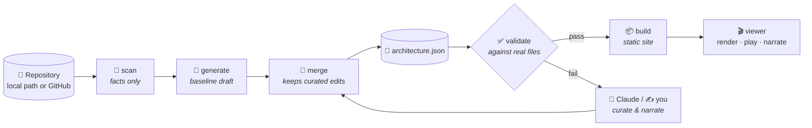

<div align="center">



<br>

[](https://github.com/Kaushik2210/gitVisualise/actions/workflows/ci.yml)
[](LICENSE)
[](https://github.com/Kaushik2210/gitVisualise/stargazers)
[](package.json)
[](package.json)
[](CONTRIBUTING.md)
[](https://github.com/Kaushik2210/gitVisualise/labels/good%20first%20issue)

**Paste a GitHub link. Get an animated, narrated, click-through map of how the repo works.**<br>
Free, open source, and it runs in your browser: no sign-up, no server, no API keys.

### [▶ Try it now: kaushik2210.github.io/gitVisualise](https://kaushik2210.github.io/gitVisualise/)

[**Website**](#-the-website) ·
[**GitHub Action**](#-github-action) ·
[**Claude Code skill**](#-use-it-with-claude-code) ·
[**CLI**](#-command-line) ·
[**Help wanted**](#-help-wanted) ·
[**Roadmap**](ROADMAP.md) ·
[**Contribute**](CONTRIBUTING.md)

</div>

---

## Why?

Onboarding onto a codebase means reading a hundred files to answer "what talks to what, and where do I start?"
Architecture diagrams answer that, until they go stale or turn out to be someone's optimistic sketch.

**gitvisualise generates the tour from the code itself, and refuses to show anything it cannot point to.**
Every box and arrow links to real files and lines, a validator rejects invented ones, and the whole thing is
regenerated (without losing your edits) when the code changes.

## 📸 See it

<p align="center">
  
</p>

<p align="center">
  <picture>
    <source media="(prefers-color-scheme: dark)" srcset="docs/assets/tour-dark.png">
    
  </picture>
</p>

<table>
  <tr>
    <td width="62%" align="center">
      <picture>
        <source media="(prefers-color-scheme: dark)" srcset="docs/assets/diff-dark.png">
        
      </picture><br>
      <sub><b>Compare two revisions</b> (<code>owner/repo@v5.0.0...v11.0.0</code>): green added, red removed, amber changed</sub>
    </td>
    <td width="38%" align="center">
      <br>
      <sub><b>Works on small screens</b></sub>
    </td>
  </tr>
</table>

<p align="center">
  <br>
  <sub>The website: paste a link, or pick a repository from a GitHub account.</sub>
</p>

These are real captures of the tool run on [tj/commander.js](https://github.com/tj/commander.js).

## ✨ What you get

|  |  |
|---|---|
| 🌐 **A website for any repo** | Paste a link, or pick from a GitHub account. No install, no sign-up |
| 🗺️ **Interactive diagram** | Components laid out in layers, with pan, zoom and a "zoom to step" camera |
| ▶️ **Guided flows** | Play, pause, next, previous, restart, speed control, progress dots, keyboard shortcuts, deep links to any step |
| 🔌 **Request tracing** | A `fetch`/`axios` call (including through a client with a literal `baseURL`) is linked to the server route that handles it, with evidence on both sides and a "Request: GET /x" tour |
| 🔀 **Compare two revisions** | `owner/repo@v1...v2` marks components and relationships added, removed or changed, and narrates the difference |
| 🗄️ **Infrastructure and data model** | Docker Compose services (with `depends_on` and the code each one is built from) and SQL / Prisma tables with their foreign keys become components too, each pointing at the file and line it came from, with a tour of each |
| 🧩 **Monorepos** | One component per workspace package, or analyse a single folder (`owner/repo:apps/web`) |
| 🔎 **Search, swimlanes, export** | Find a component with `/`, group by folder or kind, save the diagram as SVG or PNG, copy it as Mermaid or PlantUML, or copy a README badge that links back to the tour |
| 🔊 **Voice narration** | Uses your browser's built-in speech: pick a voice, stop, mute. No server, no keys |
| 🔗 **Click through to source** | Every component shows its code and an **Open Source** link to the exact lines on GitHub |
| ✅ **Grounded by construction** | Validator rejects nonexistent files, out-of-range lines, and fake paths in narration |
| 🔁 **Regenerate safely** | Curated items (by you or Claude) survive every re-run |
| 📱 **Works everywhere** | Phone layout, dark mode, reduced-motion support, no-JavaScript fallback |
| 🪶 **Zero dependencies** | Static files, plain JavaScript. Node 18+ only if you use the CLI |

## 🌐 The website

**[kaushik2210.github.io/gitVisualise](https://kaushik2210.github.io/gitVisualise/)**

1. **Paste** `github.com/owner/repo` (or just `owner/repo`), **or** type a username to **pick from their repos**.
2. Watch it read the repo, then **play the tour**. Share it, or download it as a single HTML file or JSON.
3. Deep links work: `…/gitvisualise/#/tj/commander.js` opens straight into that repo's tour, and `owner/repo@branch` pins a ref.
   A link can also name a step (`…/flow/startup/step/3`), a folder of a monorepo (`owner/repo:apps/web`) or a comparison (`owner/repo@v1...v2`).

**How it works with no server:** your browser asks GitHub's public API for the commit and file tree (2 requests),
downloads the source files from `raw.githubusercontent.com`, and runs the *same* scanner, generator and validator the
CLI uses. Nothing is uploaded anywhere but requests to GitHub, unless you turn on the optional AI narration below.

| | |
|---|---|
| **Public repos** | Work anonymously. GitHub allows 60 API requests per hour per network (each tour uses 2) |
| **Private repos / more headroom** | Add a [fine-grained token](https://github.com/settings/personal-access-tokens/new) with read-only *Contents* access. It is sent only to `api.github.com`, and kept in memory unless you tick "remember" |
| **Repos that publish their own tour** | If `docs/architecture/architecture.json` exists, you get the authors' curated tour, checked against the real files |
| **Safety** | The tour plays in a sandboxed frame with no access to the page or your token. Repo text is never inserted as HTML |
| **Big repos** | Analyses the 300 shallowest source files (tests, examples and tooling skipped) and says so |
| **Repeat visits** | Tours are cached in your browser (IndexedDB) per commit, so reopening one costs a single request. "Clear cached tours" empties it; private repos are cached only if you opt in |
| **AI narration (optional)** | **Export → Narrate with AI…** lets a language model rewrite the plain narration, using **your own API key** (Anthropic for now). Nothing is sent until you press Start and tick a confirmation. What is sent is listed in the dialog and can be previewed: for each step its title, the names, kinds and one-line summaries of its components, how they connect, and the current narration. **Never source code or file contents.** The key stays in memory and goes only in a request header to the provider. A rewritten step is used only if it is short plain prose that names nothing outside the tour, the tour must still pass validation, and rewritten steps are labelled *AI-written*. It is tested against a fake provider (no network in the tests), so if a provider changes its API, please open an issue |
| **Sign in with GitHub** | Optional and off by default: it needs a tiny token-exchange function that a maintainer deploys. See [`server/github-oauth`](server/github-oauth/README.md) |

## ⚙️ GitHub Action

Regenerate your repo's tour on every push and publish it to GitHub Pages. Curated edits are preserved.

```yaml
# .github/workflows/architecture.yml
name: Architecture tour
on:
  push:
    branches: [main]
  workflow_dispatch:
permissions:
  contents: read
  pages: write
  id-token: write
jobs:
  deploy:
    runs-on: ubuntu-latest
    environment:
      name: github-pages
      url: ${{ steps.deployment.outputs.page_url }}
    steps:
      - uses: actions/checkout@v4
      - uses: Kaushik2210/gitVisualise@main
        with:
          out: docs/architecture     # keep curated architecture.json here
      - uses: actions/upload-pages-artifact@v3
        with:
          path: docs/architecture
      - id: deployment
        uses: actions/deploy-pages@v4
```

Inputs: `path` (default `.`), `out` (default `docs/architecture`), `include` (`tests,examples,tooling`),
`ignore` (comma-separated paths), `force` (build even if a curated tour has stale references)., and `comment-diff` (see below).

**Comment the architecture diff on pull requests** (off by default). When someone changes how components connect, a reviewer sees it
without opening a diagram: one comment, updated on every push, listing added, removed and changed components and relationships, with a
link that opens the comparison as a tour.

```yaml
# .github/workflows/architecture-diff.yml
name: Architecture diff
on: pull_request
permissions:
  contents: read
  pull-requests: write
jobs:
  diff:
    runs-on: ubuntu-latest
    continue-on-error: true          # a missing comment must never block a pull request
    steps:
      - uses: actions/checkout@v4
      - uses: Kaushik2210/gitVisualise@main
        with:
          comment-diff: 'true'
```

It compares freshly generated architectures of the base and the pull request (so curated edits never show up as noise), posts nothing when
nothing structural changed, and rewrites its own earlier comment if a later push makes the change disappear. On pull requests from forks
GitHub gives the workflow a read-only token, so there the step reports a notice and skips the comment instead of failing.
In your repo's **Settings → Pages**, set the source to **GitHub Actions**.
A step-by-step walkthrough, including hosting from a branch and curating the narration, is in the [publishing guide](guides/publish-your-tour.md).

## 🧩 VS Code

The [`vscode-extension`](vscode-extension/README.md) opens the tour of the workspace beside your code and turns every **Open Source** link into a jump to that file and line in the editor. It analyses locally, writes nothing into your repository, and runs the tour under a strict Content-Security-Policy. It is version 0.1 and not on the Marketplace yet; the README explains how to run or package it.

## 🤖 Use it with Claude Code

The website and CLI give you an automatic picture (imports, entry points, dependencies) with **no AI and no API key**.
Add the skill and Claude Code reads your code and writes the real explanation on top:

```bash
git clone https://github.com/Kaushik2210/gitVisualise.git gitvisualise
node gitvisualise/skills/repo-architecture/scripts/gitvisualise.mjs install-skill            # → ~/.claude/skills
node gitvisualise/skills/repo-architecture/scripts/gitvisualise.mjs install-skill --project  # → ./.claude/skills
```

Then, in any repo:

> **"Generate an interactive architecture for this project."**

Claude Code follows [`SKILL.md`](skills/repo-architecture/SKILL.md): **scan** the repo → **read** the code that
matters → write `architecture.json` and narration → **validate** every claim against the real files → **build**
the site → check it in a browser. Ask again after your code changes and it updates the docs while keeping the
edits you (or it) already made. Commit `docs/architecture/` and the website will show *your* curated tour for your repo.

## ⌨️ Command line

```bash
git clone https://github.com/Kaushik2210/gitVisualise.git gitvisualise && cd gitvisualise

# any local repo → <repo>/docs/architecture/
node skills/repo-architecture/scripts/gitvisualise.mjs all /path/to/your/repo
node skills/repo-architecture/scripts/gitvisualise.mjs serve /path/to/your/repo   # → http://localhost:4173

# any public GitHub repo, by URL (shallow-cloned for you)
node skills/repo-architecture/scripts/gitvisualise.mjs all https://github.com/tj/commander.js
```

> [!TIP]
> Run `npm link` once and use `gitvisualise all .` from anywhere.

```
gitvisualise <command> [repo] [options]
  scan | generate | validate | build | all | serve | watch | diff | export | install-skill
  --out <dir>   --ref <ref>   --path <dir>   --repo-url <url>   --max-nodes <n>
  --ignore a,b  --include tests,examples,tooling   --no-pin   --force   --port <n>
```

Four more things worth knowing:

```bash
# one package of a monorepo (paths stay repo-relative, so links and validation still work)
gitvisualise all https://github.com/owner/repo --path packages/api

# what changed between two revisions: generate each, then compare (add --root <newer checkout> to build a page)
gitvisualise generate . --out old && git checkout main && gitvisualise generate . --out new
gitvisualise diff old new --out changes --root .

# keep the tour fresh while you work: rebuilds on every change, hand edits of architecture.json included
gitvisualise watch . --serve

# paste the architecture into a README or wiki: Mermaid renders natively on GitHub (PlantUML works too)
gitvisualise export . --format mermaid --out docs/architecture.mmd
```

## 🧠 How it works



The scanner, generator, validator and page renderer are **pure code with no Node dependencies**
([`lib/core/`](skills/repo-architecture/scripts/lib/core)), so the exact same logic runs in the CLI (over a folder on disk)
and in the website (over files fetched from GitHub). One implementation, two front ends.

| Stage | Code | Responsibility |
|---|---|---|
| **Scan** | [`scan-core.mjs`](skills/repo-architecture/scripts/lib/core/scan-core.mjs) | Files, resolved imports, entry points, routes, dependencies. Never guesses. |
| **Generate** | [`generate.mjs`](skills/repo-architecture/scripts/lib/generate.mjs) | Turns facts into nodes, edges and a starter flow |
| **Merge** | [`merge.mjs`](skills/repo-architecture/scripts/lib/merge.mjs) | Preserves `origin: claude / manual` and `locked` items across regenerations |
| **Validate** | [`validate-core.mjs`](skills/repo-architecture/scripts/lib/core/validate-core.mjs) | Sources exist (exact case), lines in range, steps reference real nodes, prose paths exist |
| **Build** | [`build-core.mjs`](skills/repo-architecture/scripts/lib/core/build-core.mjs) | Page with data and code snippets inlined, plus a no-JS fallback |
| **Load (web)** | [`github-loader.mjs`](skills/repo-architecture/scripts/lib/web/github-loader.mjs) | Analyses a GitHub repo from a browser via the public API |
| **View** | [`viewer/`](skills/repo-architecture/viewer) | A generic renderer, playback engine and narration. Knows nothing about your project. |

All project knowledge lives in one file, [`architecture.json`](skills/repo-architecture/reference/schema.md). The
viewer is a pure function of it.

## 🌍 What it understands

| Language | Import graph | Notes |
|---|:---:|---|
| JavaScript / TypeScript (incl. JSX/TSX, Vue, Svelte) | ✅ | ES modules, `require`, dynamic `import()`, `<script src>`; `tsconfig`/`jsconfig` `paths`, `baseUrl` and `extends`, plus simple Vite and webpack aliases |
| Python | ✅ | Absolute and relative imports (Python 3 semantics), `__init__.py` re-exports, `src/` layouts, entry detection |
| Go | ✅ | Packages (directories) as nodes, module-internal imports, `go.mod` and `go.work` |
| Java | ✅ | Classes, nested classes, static and wildcard imports resolved to real files; Maven and Gradle dependencies; Spring Boot entry points |
| Kotlin | ✅ | Class, wildcard and aliased imports resolve to Kotlin or Java files in the repository; `fun main` entry points |
| Rust | ✅ | `mod`, `use crate::`/`self::`/`super::`, workspaces and `Cargo.toml` dependencies |
| C# | ✅ | `using` directives resolved through declared namespaces and types (only to files that are really used), `.csproj` NuGet packages, `Main` and ASP.NET entry points |
| Ruby | ✅ | `require_relative`, `require` through `lib/` and the load path, gems from `Gemfile` and gemspecs |
| PHP | ✅ | `use` (including group use) through declared classes and PSR-4, `require` with literal paths, `composer.json` packages |
| C / C++ | ✅ | Quoted `#include`s through relative paths and CMake / Makefile include directories, `main` entry points |
| Dart / Flutter | ✅ | `package:` imports of this repository's packages (monorepos included), relative imports, `export` and `part`, `pubspec.yaml` dependencies |
| Everything else | ➖ | Structure, manifests and dependencies only. **[Add yours!](#-help-wanted)** |

Beyond code, two extra views are read when the files exist: **infrastructure** (services, `depends_on` and build contexts from `docker-compose.yml` / `compose.yaml`) and **data model** (tables and foreign keys from `CREATE TABLE` / `ALTER TABLE … FOREIGN KEY` in `.sql` files, and models and `@relation`s from `schema.prisma`; a migration history counts as one schema). ORM models in code, Kubernetes and Terraform are not read yet.

Also detected: dependencies from `package.json`, `requirements.txt`, `pyproject.toml`, `go.mod`, `pom.xml`, `build.gradle` and
`Cargo.toml`; workspaces (npm, pnpm, Cargo, `go.work`); server routes (only when a real server framework is imported, with
Express router mounts and Flask `methods=[...]` resolved); the HTTP calls that reach them; and entry points.

## 🎛️ Viewer controls

| Action | Control |
|---|---|
| Play / pause | Button or `Space` |
| Next / previous step | Buttons or `→` / `←` |
| Restart | Button or `R` |
| Jump to a step | Click the progress bar or its dots |
| Speed | 0.5x, 1x, 1.5x, 2x |
| Narration | Toggle, Stop, voice picker |
| Follow the action | "Zoom to step" (on by default on small screens) |
| Inspect a component | Click it: summary, dependencies, code, Open Source |
| Close details | `Esc` |
| Fold a group | With "By kind" or "By group", click a lane header (or focus it and press `Enter`) to collapse it into one chip and again to expand; "Collapse all" / "Expand all" does every lane. Playback, search and selection open or light up the chip as needed |
| Search components | `/`, then type; `Enter` cycles through matches |
| Move between components (keyboard) | `Tab`, then `→` / `←` follow a connection out / in, `↑` / `↓` move within a column, `Enter` opens details |
| Screen readers | Steps, selections and search results are announced; a skip link jumps to the narration and controls |

## 🙋 Help wanted

**gitvisualise is open source and looking for contributors.** The core works end to end (website, CLI, skill and
Action). Every task below is a real, scoped issue with acceptance criteria and pointers to the exact files, so you can
start without asking. Comment "I'll take this" and a maintainer will help you get going.

[**Browse good first issues →**](https://github.com/Kaushik2210/gitVisualise/labels/good%20first%20issue) &nbsp;·&nbsp;
[**All help wanted →**](https://github.com/Kaushik2210/gitVisualise/labels/help%20wanted) &nbsp;·&nbsp;
[**Start a discussion →**](https://github.com/Kaushik2210/gitVisualise/discussions)

**🟢 Good first issues** (an afternoon each)

- [#7](https://github.com/Kaushik2210/gitVisualise/issues/7) Add a demo GIF and screenshots to the README
- [#42](https://github.com/Kaushik2210/gitVisualise/issues/42) CLI: `gitvisualise init` sets a repository up in one command
- [#43](https://github.com/Kaushik2210/gitVisualise/issues/43) A community gallery of tours, added by pull request
- [#44](https://github.com/Kaushik2210/gitVisualise/issues/44) Viewer: a "?" keyboard shortcuts overlay
- [#45](https://github.com/Kaushik2210/gitVisualise/issues/45) Viewer: a colour-blind-safe palette option

**🟡 Intermediate**

- [#46](https://github.com/Kaushik2210/gitVisualise/issues/46) Export the whole tour as a printable document
- [#47](https://github.com/Kaushik2210/gitVisualise/issues/47) Language support: Swift import graph
- [#48](https://github.com/Kaushik2210/gitVisualise/issues/48) Language support: Scala
- [#49](https://github.com/Kaushik2210/gitVisualise/issues/49) Data model: read ORM models from application code
- [#50](https://github.com/Kaushik2210/gitVisualise/issues/50) Request tracing: read routes from OpenAPI documents
- [#51](https://github.com/Kaushik2210/gitVisualise/issues/51) Performance: process the file tree off the main thread
- [#52](https://github.com/Kaushik2210/gitVisualise/issues/52) Viewer: a minimap for large diagrams
- [#53](https://github.com/Kaushik2210/gitVisualise/issues/53) Diff: detect renamed and moved files
- [#54](https://github.com/Kaushik2210/gitVisualise/issues/54) Infrastructure view: Kubernetes manifests
- [#57](https://github.com/Kaushik2210/gitVisualise/issues/57) VS Code extension: "where am I?" and Marketplace publishing

**🔴 Ambitious** (discuss the design first)

- [#14](https://github.com/Kaushik2210/gitVisualise/issues/14) Sign in with GitHub to list private repositories
- [#55](https://github.com/Kaushik2210/gitVisualise/issues/55) Infrastructure view: Terraform resources
- [#56](https://github.com/Kaushik2210/gitVisualise/issues/56) Request tracing: GraphQL operations to resolvers

The full plan, grouped into milestones, is in [ROADMAP.md](ROADMAP.md).

<details>
<summary><b>✅ Already shipped from this list</b> (34 issues closed)</summary>

Closed so far: #1, #2, #3, #4, #5, #6, #8, #9, #10, #11, #12, #13, #15, #16, #20, #21, #22, #23, #24, #26, #27, #28, #29, #30, #31, #32, #33, #34, #35, #36, #37, #38, #39, #40. The changelog says what each one delivered.

</details>

**Ideas without an issue yet:** opt-in higher-quality narration voices, and Windows path-length edge cases. Open an issue to propose one.

> [!NOTE]
> Got a different idea? **Build something new.** The scanner, the data format and the viewer are all small and
> readable on purpose. See [CONTRIBUTING.md](CONTRIBUTING.md) for the four ground rules and a step-by-step guide to
> adding a language.

### Contributors

[](https://github.com/Kaushik2210/gitVisualise/graphs/contributors)

## 🧭 Design principles

1. **Grounded, never invented.** If it cannot be pointed at in the repo, it does not go in the diagram.
2. **Zero dependencies.** Standard library and plain browser scripts. Nothing to install, nothing to audit.
3. **Generic engine, specific data.** The viewer never contains project-specific logic.
4. **No keys, no bills.** The core path uses no paid service and no backend. Speech is the browser's own.
5. **Never destroy human work.** Regeneration merges; it does not overwrite.
6. **Repo content is untrusted.** Escaped everywhere, and played in a sandbox.

## 🗂️ Project layout

```
site/                            ← the website (landing page + app logic) → assembled into docs/
server/github-oauth/             ← optional token-exchange function for "Sign in with GitHub" (off by default)
skills/repo-architecture/        ← the installable Claude Code skill (and the whole engine)
├── SKILL.md                     ← instructions for Claude Code
├── reference/schema.md          ← the architecture.json format
├── scripts/
│   ├── gitvisualise.mjs         ← CLI: scan | generate | validate | build | all | serve | diff | install-skill
│   └── lib/
│       ├── core/                ← pure logic shared by CLI and website (scan, validate, build, text, posix)
│       ├── web/github-loader.mjs← analyse a GitHub repo from a browser
│       └── generate.mjs, merge.mjs, scan.mjs, …  (Node adapters + generator)
└── viewer/                      ← renderer, playback engine, narration (HTML/CSS/JS)
action.yml                       ← the GitHub Action
tools/build-site.mjs             ← assembles site/ + core + viewer into docs/
docs/                            ← what GitHub Pages serves
├── index.html …                 ← the website (generated by `npm run site`)
└── architecture/                ← this project's own curated tour
test/                            ← node:test suite
```

## 🧪 Develop

```bash
npm test          # scanner, languages, generator, validator, merge, builder, GitHub loader (with a fake GitHub), diff, request tracing, OAuth
npm run site      # rebuild the website into docs/ (CI fails if you forget)
npm run serve     # http://localhost:4173 → the website
npm run docs      # regenerate this repo's own tour (curated content is preserved)
```

## Limits

- Dynamic dispatch and runtime autoloading (Rails constants, PHP classmaps, reflection) are not resolved, and only the alias forms in `tsconfig`/`jsconfig`, Vite and webpack are understood. Request tracing links a call to a route only on an exact method-and-path match; a literal `baseURL` / `prefixUrl` set in the same file is applied, but clients configured in another file, OpenAPI documents and GraphQL are not followed yet.
- A comparison matches components by id, so a moved or renamed file shows as one removal plus one addition.
- The automatic narration is templated; the Claude Code skill is what turns it into an explanation.
- The website analyses public repos anonymously (GitHub's 60 requests/hour per network); private repos need a token.
- Very large repos are sampled (300 shallowest source files), and GitHub truncates huge file listings.
- Voice quality depends on the voices your OS and browser provide.

## 📄 License

[MIT](LICENSE). Use it, fork it, ship it, teach with it.

<div align="center">

**If this helps you, [⭐ star the repo](https://github.com/Kaushik2210/gitVisualise) and tell a teammate.**<br>
Have an idea or found a bug? [Open an issue](https://github.com/Kaushik2210/gitVisualise/issues/new/choose) or [start a discussion](https://github.com/Kaushik2210/gitVisualise/discussions).

</div>
