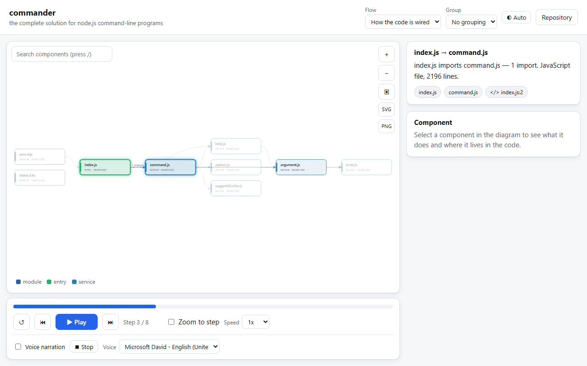

# Publish your own architecture tour

The website gives any repository an automatic picture. If you publish a tour **in your repository**, visitors get *your* tour
instead, with narration you wrote (or Claude wrote and you edited), checked against the real files. This guide takes about ten minutes.

<p align="center">
  
</p>

| | Automatic (website only) | Published in your repo |
|---|---|---|
| Diagram | From static imports | The same, plus anything you curate |
| Narration | Templated | Written by you or Claude, validated |
| Who sees it | Anyone who pastes your link | Anyone, and it is the one the site prefers |
| Stays fresh | Always (built from the latest code) | Regenerated by an Action or `gitvisualise watch` |

## 1. Generate it locally

You need Node 18 or newer. No install, no dependencies.

```bash
git clone https://github.com/Kaushik2210/gitVisualise.git gitvisualise
node gitvisualise/skills/repo-architecture/scripts/gitvisualise.mjs all /path/to/your/repo
node gitvisualise/skills/repo-architecture/scripts/gitvisualise.mjs serve /path/to/your/repo   # http://localhost:4173
```

`all` scans the repository, writes `docs/architecture/architecture.json`, validates every reference against your files, and builds
`docs/architecture/index.html`. If validation fails, the command tells you which file or line is wrong and stops.

Useful options: `--ignore vendor,generated` to skip folders, `--include tests,examples` to also draw them, `--path packages/api` for
one package of a monorepo. Run `gitvisualise --help` for the full list.

## 2. Commit it

```bash
git add docs/architecture
git commit -m "docs: add an architecture tour"
git push
```

That is enough for the website: pasting `github.com/you/your-repo` now shows a **Curated by the repo's authors** badge, because the
website looks for `docs/architecture/architecture.json` on your default branch.

## 3. Host the page itself (optional)

The tour is a static folder, so GitHub Pages can serve it at `https://<you>.github.io/<repo>/architecture/`. Pick one way.

### Option A: from a branch (simplest)

1. In your repository open **Settings → Pages**.
2. Under **Build and deployment**, set **Source** to **Deploy from a branch**.
3. Choose your default branch and the **/docs** folder, then **Save**.
4. After a minute the page is live at `https://<you>.github.io/<repo>/architecture/`.

> **Mind the capitals.** Pages URLs are case-sensitive. If your repository is called `MyRepo`, `…/myrepo/architecture/` is a 404.

### Option B: with the GitHub Action (stays fresh automatically)

The Action regenerates the tour on every push, keeping anything you curated.

1. In **Settings → Pages**, set **Source** to **GitHub Actions**.
2. Add `.github/workflows/architecture.yml`:

   ```yaml
   name: Architecture tour
   on:
     push:
       branches: [main]
     workflow_dispatch:
   permissions:
     contents: read
     pages: write
     id-token: write
   jobs:
     deploy:
       runs-on: ubuntu-latest
       environment:
         name: github-pages
         url: ${{ steps.deployment.outputs.page_url }}
       steps:
         - uses: actions/checkout@v4
         - uses: Kaushik2210/gitVisualise@main
           with:
             out: docs/architecture
         - uses: actions/upload-pages-artifact@v3
           with:
             path: docs/architecture
         - id: deployment
           uses: actions/deploy-pages@v4
   ```

3. Push. The **Actions** tab shows the run, and the deployment step prints the live URL.

Action inputs: `path`, `out`, `include`, `ignore` and `force` (see [`action.yml`](../action.yml)). Set `force: 'true'` only if you knowingly
keep a curated tour whose line numbers have drifted.

## 4. Make the narration yours (optional, recommended)

The automatic narration is templated ("A imports B"). The **Claude Code skill** rewrites it as an explanation of your actual code:

```bash
node gitvisualise/skills/repo-architecture/scripts/gitvisualise.mjs install-skill
```

Then, in Claude Code, inside your repository, ask: *"Generate an interactive architecture for this project."* Claude reads your code,
names the real components, writes the tour, and runs the validator, so it cannot cite a file or line that does not exist.

**Your edits are safe.** Items written by Claude or by hand carry `"origin": "claude"` or `"manual"`, and anything with `"locked": true` is never overwritten.
Regenerating (by hand, by `watch`, or by the Action) refreshes only the automatic parts. The rules are in
[`reference/schema.md`](../skills/repo-architecture/reference/schema.md).

To edit by hand, open `docs/architecture/architecture.json`, change a `summary` or a step's `narration`, and set `"origin": "manual"` on it.
While `gitvisualise watch . --serve` is running the page rebuilds as you save.

## 5. Keep it honest

- **Validate anytime:** `gitvisualise validate .` fails on a missing file, an out-of-range line, or a path in the narration that does not exist.
- **Check it in CI:** the Action already validates before building. To only check, run the same command in a workflow step.
- **After a refactor:** a curated step may point at a line that moved. The validator names it; fix the number or rerun the skill.

## 6. Tell people

Add a badge to your README that opens the tour on the website. On any results page use **Export → Copy README badge**, or write it yourself:

```markdown
[](https://kaushik2210.github.io/gitVisualise/#/you/your-repo)
```

To put the diagram straight into a README instead, use `gitvisualise export . --format mermaid`. GitHub renders Mermaid natively.

## Troubleshooting

| Symptom | Cause and fix |
|---|---|
| `Validation FAILED: … does not exist in the repository` | A curated reference is stale. Fix the path or line it names (paths are relative to the repo root and case-sensitive). |
| The Pages URL is a 404 | Wrong capitalisation, Pages source not set, or the first deployment has not finished. Check **Settings → Pages** for the live URL. |
| The website still shows the automatic tour | `docs/architecture/architecture.json` must be on your **default branch**. Check the file is pushed there. |
| Too many or too few components | `--max-nodes 20` changes how coarsely files are grouped; `--ignore` and `--include` change what is scanned. |
| A private repository | The website needs a token for private repos (see the README). The CLI and Action work on private repos as they run with your access. |

Something not covered here? [Open an issue](https://github.com/Kaushik2210/gitVisualise/issues/new/choose) and we will improve this guide.
